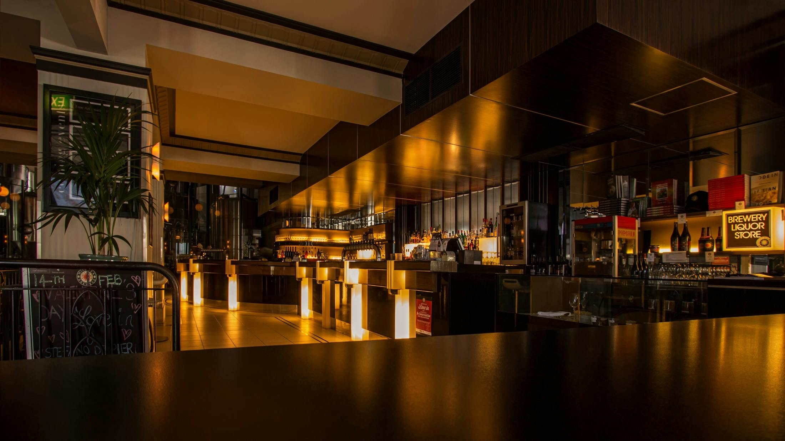

<div align="center">
  

  <br />
  <br />

  <h1>
    
    EL DORADO - Restaurante Peruano
    
  </h1>

  <p align="center">
    <strong>Auténtica Cocina Peruana — Costa, Sierra y Selva en tu mesa</strong>
  </p>
  
  <p align="center">
    Un proyecto web avanzado y profesional desarrollado en <b>React.js</b>. <br/> Destaca por su diseño arquitectónico moderno, uso de <i>Glassmorphism</i>, animaciones asíncronas y tipografías ultra-elegantes.
  </p>

  <div align="center">
    
    
    
    
    
  </div>

  <br />
</div>

<hr />

## 🚀 Sobre el Proyecto

**EL DORADO** no es solo una página web; es una experiencia digital gastronómica. La aplicación ha sido reescrita desde cero respetando los más estrictos estándares de la industria, garantizando alto rendimiento operativo (SEO, Accesibilidad, Performance) y un diseño de interfaz de usuario (UI/UX) simplemente exquisito.

### 💎 Características Principales (Core Features)

<table align="center" width="100%">
  <tr>
    <td align="center" width="25%">
      
      <br />
      <b>Glassmorphism UI</b><br />
      <i>Navbars translúcidos y tarjetas flotantes de apariencia cristalina.</i>
    </td>
    <td align="center" width="25%">
      
      <br />
      <b>Animaciones CSS3</b><br />
      <i>Transiciones fluidas, hover effects tipo zoom y revelación en cascada.</i>
    </td>
    <td align="center" width="25%">
      
      <br />
      <b>Responsive Design</b><br />
      <i>Adaptabilidad pixel-perfect desde móbiles pequeños a pantallas 4K.</i>
    </td>
    <td align="center" width="25%">
      
      <br />
      <b>Hooks Modernos</b><br />
      <i>Uso optimizado de <code>useState</code> & <code>useEffect</code> para estado local.</i>
    </td>
  </tr>
</table>

<br />

## 📁 Arquitectura del Código

El sistema de archivos ha sido concebido para escalar. Nos hemos asegurado de separar lógicas, estilos y componentes de enrontamiento:

```text
📦 src
 ┣ 📂 components (Opcional en próximas versiones)
 ┣ 📜 App.js            # Enrutador principal (React Router DOM)
 ┣ 📜 index.css         # Design Tokens y Sistema Global CSS
 ┣ 📜 estilo1.css       # Reglas estéticas, animaciones y Media Queries
 ┣ 📜 Menu.js           # Navbar principal interactivo (Glass)
 ┣ 📜 Carrusel.js       # Hero dinámico 100vh interactivo
 ┣ 📜 carta.js          # Tabbed Navigation para menús de comida
 ┣ 📜 quienesomos.js    # Layout avanzado visual
 ┣ 📜 productos.js      # Tarjetas dinámicas super responsive
 ┣ 📜 Proveedores.js    # Storytelling alterno entre imagen y texto
 ┣ 📜 Contacto.js       # Validación de form, Mapas & loading states
 ┗ 📜 Footer.js         # Pie de página jerárquico y profesional
```

---

## 🎨 Design System Exclusivo

Para lograr un acabado *Premium*, el proyecto inyecta un set de estilos de alta gama:

- **Tipografías Profesionales:** Uso extensivo de **Playfair Display** para evocar la tradición y elegancia de los restaurantes del más alto nivel, combinado con **Inter** para garantizar legibilidad en bloques de texto.
- **Microinteracciones:** Todo tiene retroalimentación visual. Los enlaces cambian suavamente de color, las tarjetas se elevan al sentirlas con el cursor y el navbar proyecta una sombra tras iniciar el scroll hacia abajo.
- **Esquema de Color:**
  - 🍷 **Rojo Primario:** `#8B1A1A` 
  - 🥇 **Dorado Secundario:** `#C8860A` o alternos para badges.
  - ☁️ **Tonos de Fondo:** `#FAF3E8` y escalas neutras limpias.

---

## ⚙️ Instalación y Configuración

Para correr este proyecto en local y admirar la magia:

1. **Clonar este Repositorio**
   ```bash
   git clone https://github.com/TuUsuario/ELDORADO.git
   ```

2. **Acceder al Directorio**
   ```bash
   cd ELDORADO
   ```

3. **Instalar Dependencias**
   ```bash
   npm install
   ```

4. **Levantar el Servidor de Desarrollo**
   ```bash
   npm start
   ```

> [!TIP]
> 🌐 Visita `http://localhost:3000` en tu navegador para ver la experiencia en vivo.

---

## 👨‍💻 Autor

**Hector Palacios**  
*Software Engineer | Full Stack Developer*  

Desarrollador apasionado por construir soluciones tecnológicas robustas, escalables y orientadas al negocio. Si buscas talento para tu equipo de ingeniería, ¡hablemos!

[](https://www.linkedin.com/in/hectorpalaciosromero)
[](https://github.com/hectorpalaciosromero)
